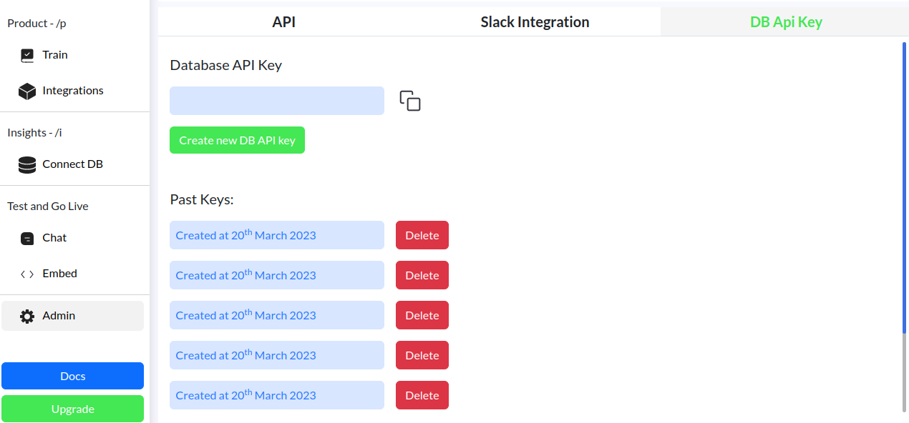

# Neuralmind DB Connector

Neuralmind DB connector converts your natural language text queries into SQL and other machine readable code.

# Installation

`npm i neuralmind-db`

# Getting your API Key



You can get your API key by going to [https://app.neuralmind.io/admin/api](https://app.neuralmind.io/admin/api) and generate a new one.

# Usage

## Starting point (Create a folder and navigate to it in your terminal)

```bash
npm init -y
npm i neuralmind-db
```

## MySQL

```js
import NeuralmindDB from "@neuralmind/db-connector";

const test = new NeuralmindDB("mysql", "your-api-key", {
  database: "store",
  username: "root",
  password: "db-password",
  host: "127.0.0.1",
  port: 3306,
});

await test.connect(); // check the connection
await test.sync(); // Sync the schema to our server (Identified by your API key)
const query = await test.query("Which products are expensive?"); // A query (In this case SQL) that you can run anywhere you want or even in our library

console.log(await test.run(query));
```

### Customize it with your own design

```js
(async () => {
  const test = new NeuralmindDB("mysql", "your-api-key", {
    database: "twitter_test",
    username: "root",
    password: "Current-Root-Password",
    host: "127.0.0.1",
    port: 3306,
  });

  await test.connect();

  // We can do hard filter
  const rules = [
    {
      name: "user_id",
      required: true,
      rule: "Every query need to include user_id and user_id value will be ${user_id}",
    },
  ];

  await test.sync([], rules);

  let query = await test.query("What are my total likes?");

  // let's replace ${user_id} with actual userId,
  const userId = 2; // this can be set by you
  query = query.replace(`\${user_id}`, `${userId}`);

  console.log(await test.run(query));
})();
```

## Postgres

```js
import NeuralmindDB from "@neuralmind/db-connector";

const test = new NeuralmindDB("postgres", "your-api-key", {
  database: "store",
  username: "root",
  password: "db-password",
  host: "127.0.0.1",
  port: 3306,
});

await test.connect(); // check the connection
await test.sync(); // Sync the schema to our server (Identified by your API key)
const query = await test.query("Which products are expensive?"); // A query (In this case SQL) that you can run anywhere you want or even in our library

console.log(await test.run(query));
```

### Customize it with your own design

```js
(async () => {
  const test = new NeuralmindDB("postgres", "your-api-key", {
    database: "twitter_test",
    username: "root",
    password: "Current-Root-Password",
    host: "127.0.0.1",
    port: 3306,
  });

  await test.connect();

  // We can do hard filter
  const rules = [
    {
      name: "user_id",
      required: true,
      rule: "Every query need to include user_id and user_id value will be ${user_id}",
    },
  ];

  await test.sync([], rules);

  let query = await test.query("What are my total likes?");

  // let's replace ${user_id} with actual userId,
  const userId = 2; // this can be set by you
  query = query.replace(`\${user_id}`, `${userId}`);

  console.log(await test.run(query));
})();
```
